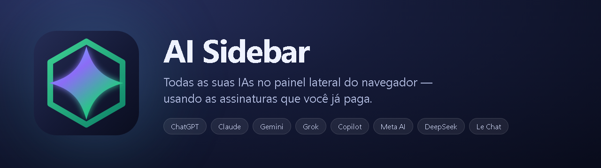
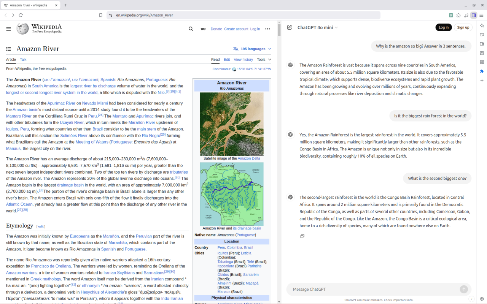
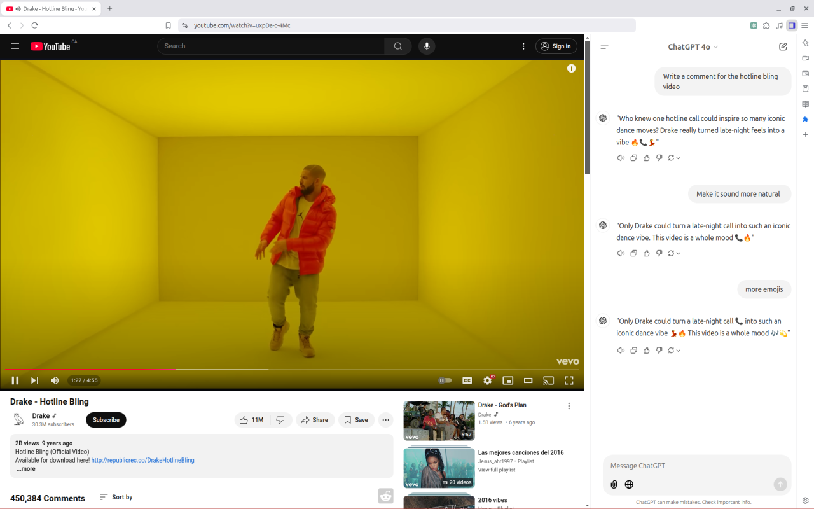

<p align="center">
  
</p>

<p align="center">
  <b>Oito IAs no painel lateral do navegador. Sem chave de API, sem mensalidade extra.</b><br>
  Você já paga pelo ChatGPT Plus, pelo Gemini ou pelo Claude Pro.<br>
  Esta extensão coloca todos eles ao lado da página que você está lendo.
</p>

---

## O problema

Trabalhar com IA hoje é um vaivém de abas. Você lê um artigo, abre outra aba para
perguntar ao ChatGPT, copia um trecho, cola, volta para o artigo, perde o contexto.
Se quiser comparar a resposta do Claude com a do Gemini, são mais duas abas.

E as alternativas costumam cobrar de novo por algo que você já tem: extensões que
pedem chave de API cobram por token, em cima de uma assinatura que você já paga.

## A proposta

O **AI Sidebar** embute as interfaces web oficiais num painel lateral. Você continua
logado nas suas contas, com o seu plano, o seu histórico e os seus modelos — só que
ao lado da página, em vez de em outra aba.

| | |
|---|---|
| **Sem chave de API** | Usa a sessão do navegador. Se você está logado, funciona. |
| **Sem custo adicional** | Nenhum token é cobrado. É a mesma interface web de sempre. |
| **Sem novo histórico** | As conversas ficam na sua conta, acessíveis de qualquer lugar. |
| **Troca instantânea** | Um seletor no topo alterna entre os oito provedores. |

<table>
<tr>
<td width="50%"></td>
<td width="50%"></td>
</tr>
<tr>
<td align="center"><sub>Pergunte sobre o que está na tela, sem copiar e colar</sub></td>
<td align="center"><sub>A página continua visível enquanto você conversa</sub></td>
</tr>
</table>

## Provedores

<p align="center">
  
  
  
  
  
  
  
  
</p>

## Recursos

### Resumir página

Um clique no botão flutuante e o texto da aba ativa vai para a IA escolhida, já com
título e URL, e a pergunta é enviada sozinha. O texto passa por uma limpeza que
remove `script`, `style`, `nav`, `header`, `footer` e `iframe` antes de ir.

Funciona nos oito provedores, não só num deles.

### Enviar seleção

Selecione qualquer texto numa página, clique com o botão direito e escolha
**Send to AI Sidebar**. O trecho é colado no provedor ativo, e o painel abre se
estiver fechado.

### Microfone e área de transferência

Ditado por voz e os botões de copiar funcionam dentro do painel — o que não é o
comportamento padrão de um iframe, e exigiu um bocado de trabalho. Veja
[Notas de implementação](#notas-de-implementação).

## Instalação

Ainda não há build publicado deste fork. Para usar a versão deste repositório:

```bash
git clone https://github.com/Clebio2030/ai-sidebar.git
```

1. Abra `chrome://extensions`
2. Ligue o **Modo do desenvolvedor**
3. **Carregar sem compactação** e aponte para a pasta clonada

Funciona em Chrome, Edge, Brave, Aside e outros Chromium com painel lateral.

## Notas de implementação

Esta seção existe porque cada item abaixo custou horas de investigação. Se você for
mexer no código — ou reencontrá-lo daqui a seis meses — comece por aqui.

### Microfone no painel lateral

Um painel lateral **não consegue exibir o aviso de permissão** do navegador. O
`getUserMedia()` falha com `NotAllowedError: Permission dismissed`: o pedido é criado
e descartado antes que alguém possa respondê-lo.

Pior, com *permission delegation* o pedido de um iframe é atribuído à origem de
**topo** — aqui `chrome-extension://<id>` — e não ao provedor. Consequências que
levaram a três tentativas frustradas:

- conceder microfone a `gemini.google.com` não resolve, mesmo que já esteja permitido
- `chrome.contentSettings` recusa padrões `chrome-extension://` com `Invalid scheme`
- `audioCapture` no manifest não é reconhecido por todos os forks do Chromium

A solução é `permission.html`: uma aba normal, onde o aviso **aparece**, pedindo
microfone para a origem da extensão. A concessão fica registrada e passa a valer
dentro do painel. O botão 🎤 no painel só aparece enquanto a permissão não existe.

### Permissions Policy no iframe

O atributo `allow` do iframe delega `microphone`, `clipboard-read/write` e outros.
Sem ele, o console acusa `Permissions policy violation`. Além disso, `background.js`
remove os cabeçalhos `Permissions-Policy` e `Feature-Policy` das respostas de
sub-frame, porque Gemini e Copilot enviam versões que desligam esses recursos.

### Qual é a aba ativa

`tabs.query({ active: true, windowType: 'normal' })` devolve **uma aba por janela**, e
pegar a primeira é arbitrário quando há mais de uma janela aberta. `findActiveTab()`
tenta `currentWindow`, depois `lastFocusedWindow`, e só então qualquer janela normal,
descartando abas restritas em cada etapa.

### Páginas que nenhuma extensão lê

O navegador proíbe injeção de script em `chrome://`, `chrome-extension://`,
`devtools://`, `view-source:` e na Chrome Web Store. O modal de página protegida
explica isso e sugere o que fazer, em vez de só falhar.

No navegador **Aside** não há esquema próprio: as páginas internas dele também são
`chrome://` (`chrome://aside-adblock`, `chrome://aside-import-data`), então a mesma
lista cobre o caso.

### Depurar com CDP

Chromium 137+ desabilitou `--load-extension`. Para carregar a extensão via protocolo
de depuração são necessários `--enable-unsafe-extension-debugging` e o comando
`Extensions.loadUnpacked`.

## Estrutura

| Arquivo | Papel |
|---|---|
| `manifest.json` | MV3; `sidePanel`, `declarativeNetRequest`, `storage`, `contextMenus`, `scripting` |
| `background.js` | Regras de cabeçalho, extração da aba ativa, menu de contexto |
| `sidepanel.html` / `.js` | Seletor, botão flutuante de resumo, modal de página protegida |
| `content.js` | Preenche o campo do provedor e envia; roda nos oito domínios |
| `permission.html` / `.js` | Concede microfone à origem da extensão |
| `icon.svg` | Fonte do ícone; os PNGs saem dele |
| `docs/banner.html` | Fonte do banner acima |

Os PNGs são renderizados a partir dos fontes com Chromium headless, então `icon.svg`
e `docs/banner.html` são a verdade — edite-os, não os PNGs.

## Aviso

Este projeto não tem vínculo com OpenAI, Google, Anthropic, xAI, Microsoft, Meta,
DeepSeek ou Mistral. Cada marca pertence ao seu titular. A extensão apenas embute as
interfaces web públicas, usando a sua própria sessão.
